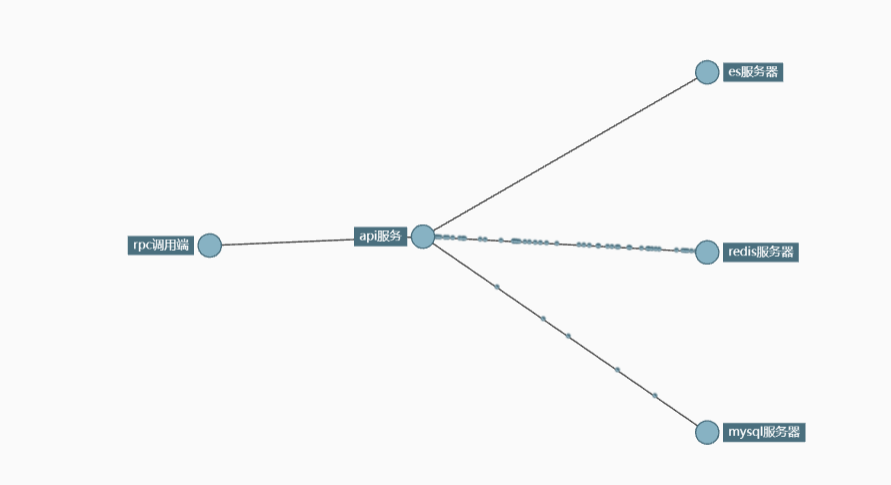
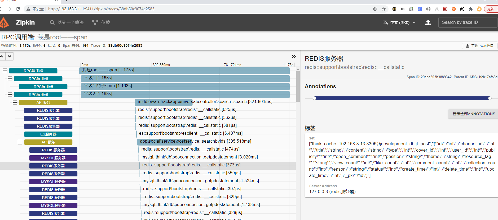

### webmanTracer使用教程

> webman的链路追踪组件，基于xiaoyangguang/aop， 实现了基本的链路追踪组件， 比如mysql es redis 开发者可自定义追踪方法函数，实现自己需要追踪的组件，可追踪composer加载的三方库，比如thinkorm的数据库执行函数  （可选择自定义收集追踪上报数据类,并配置在tracer.php中 如果example无法满足你的需求)

#### 安装

```
composer require xiaoyangguang/tracer
```

> 配置 config\plugin\xiaoyangguang\tracer\tracer.php文件

```php
<?php
//区分大小写
use app\social\service\PostService;
use support\bootstrap\EsClient;
use support\Redis;
use think\db\PDOConnection;
use Xiaoyangguang\WebmanTracer\core\TracerInitialize;
use Xiaoyangguang\WebmanTracer\example\ElasticsearchAspect;
use Xiaoyangguang\WebmanTracer\example\GenericAspect;
use Xiaoyangguang\WebmanTracer\example\MysqlAspect;
use Xiaoyangguang\WebmanTracer\example\RedisAspect;

TracerInitialize::setConfig(true);
MysqlAspect::setConfig('业务数据库', '127.0.0.1');
RedisAspect::setConfig('业务Redis');
ElasticsearchAspect::setConfig('业务Elasticsearch');
//HttpAspect::setConfig();

return [
    RedisAspect::class => [ //追踪类
       Redis::class => [  //被追踪类
            '__callStatic', //被追踪方法
        ],
    ],
    ElasticsearchAspect::class => [//追踪类
        EsClient::class => [
            '__callStatic',//被追踪方法
            '__call',//被追踪方法
        ],
    ],
    MysqlAspect::class => [//追踪类
        PDOConnection::class => [  //追踪底层数据库执行方法例子
            'getPDOStatement',//被追踪方法
        ],
    ],
    GenericAspect::class => [ //追踪类 通用追踪节点 任由开发者发挥
        PostService::class => [
            'searchByIds',
        ],
    ],
];

```

> 最后启动服务，并测试。

```shell
docker run -d --restart always -p 9411:9411 --name zipkin openzipkin/zipkin 
php start.php start
curl  http://127.0.0.1:8787

在浏览器访问：http://ip:9411/zipkin/查看平台数据
```





